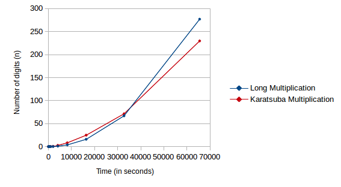

# Assignment 3 - Divide and Conquer

*Binary Multiplication:* Given two n-bit integers a and b, you have to implement two algorithms:

   1. *Long Multiplication:* Implement the brute-force O(n<sup>2</sup>) algorithm that simulates the long multiplication.
   2. *Karatsuba:* Implement the O(n<sup>log<sub>2</sub>3</sup>>)-time algorithm discussed in class to multiply a and b.


#### Running the code (in [./src](./src) folder)

1. To compile -

    ```bash
    ./compile.sh
    ```

2. To run - 

    ```bash
    ./run.sh -<karatsuba/longmultiplication> <input> <output>
    ```

#### Performance Analysis

|        n	       | Long Multiplication (in s) | 	Karatsuba (in s)   |
| ---------------- | -------------------------- | -------------------- |
|  2<sup>0</sup>   |         0.000807	        |      0.00065         |
|  2<sup>1</sup>   |         0.001152	        |      0.001096        |
|  2<sup>2</sup>   |         0.0013 	        |      0.001439        |
|  2<sup>3</sup>   |         0.000318	        |      0.003127        |
|  2<sup>4</sup>   |         0.000645	        |      0.00309         |
|  2<sup>5</sup>   |         0.001516	        |      0.0164          |
|  2<sup>6</sup>   |         0.002622	        |      0.042141        |
|  2<sup>7</sup>   |         0.001879	        |      0.103799        |
|  2<sup>8</sup>   |         0.020327	        |      0.178317        |
|  2<sup>9</sup>   |         0.093021	        |      0.345916        |
|  2<sup>10</sup>  |         0.250322	        |      1.04862         |
|  2<sup>11</sup>  |         0.919607	        |      2.9827          |
|  2<sup>12</sup>  |         7.34961	        |      8.80612         |
|  2<sup>13</sup>  |         77.4482	        |      26.2773         |
|  2<sup>14</sup>  |         607.004	        |      78.8218         |

